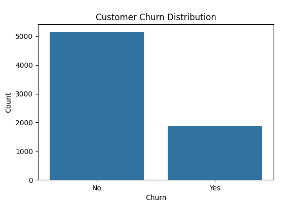
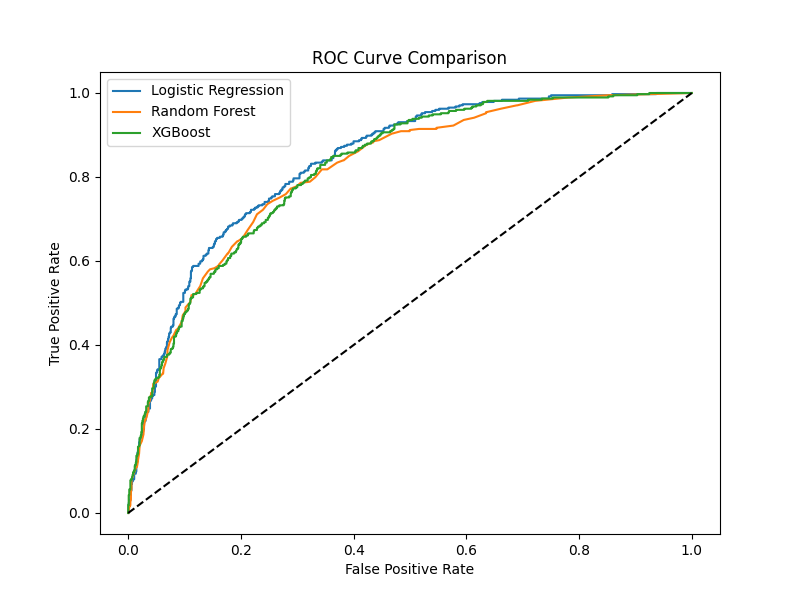
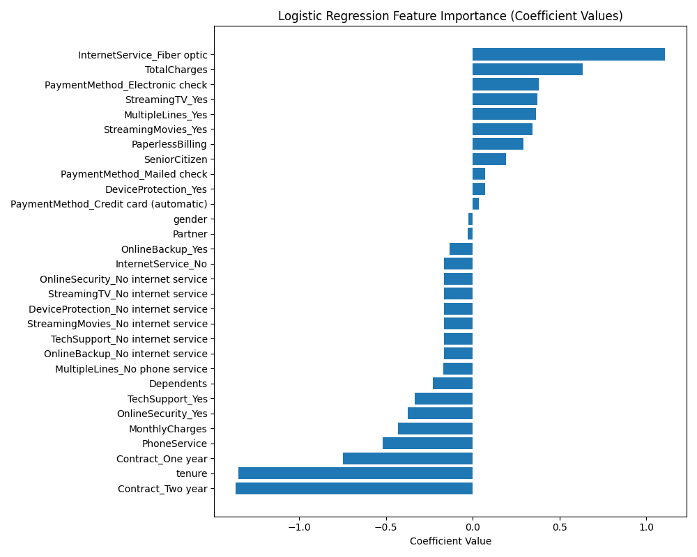
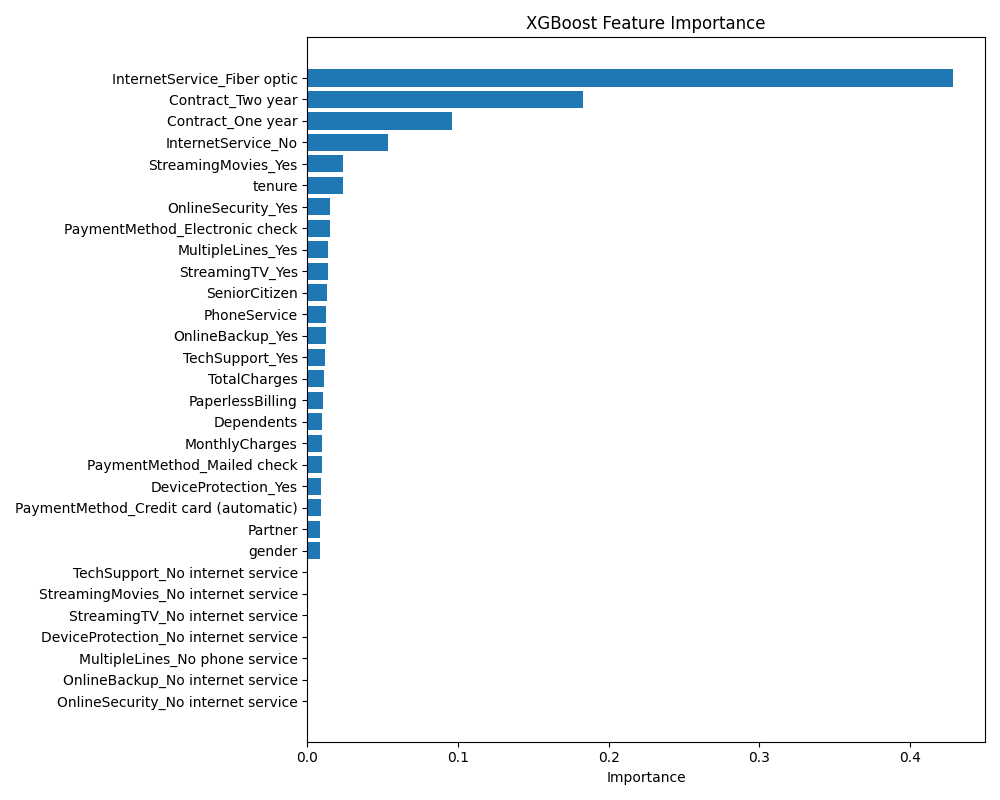

# 📊 Customer Churn Prediction — End-to-End Project

This repository showcases a complete data science pipeline to predict customer churn in a subscription-based business context. It includes detailed EDA, feature engineering, model comparison, interpretability analysis, and a prototype deployment demo.

---

## 🚀 Project Overview

**Objective:** Identify customers who are likely to churn to enable proactive retention strategies.  
**Business Value:** Improving customer lifetime value and reducing churn rates through data-driven decisions.

---


## 📊 Exploratory Data Analysis (EDA)

### Customer Churn Distribution



We first analysed the target variable distribution to identify imbalance. The dataset shows that the majority of customers do not churn, suggesting that accuracy alone may not be an appropriate evaluation metric.

---

### Feature Relationships

We explored relationships between churn and various categorical and numerical features (tenure, monthly charges, contract type, internet service, etc.), revealing several strong signals for churn behaviour.

---

## ⚙️ Modelling & Evaluation

Three models were developed and compared:

- Logistic Regression (baseline, interpretable)
- Random Forest (robust, handles interactions)
- XGBoost (powerful boosting approach)

Performance was evaluated using ROC curves and classification metrics.

### ROC Curve Comparison



The ROC curves highlight that XGBoost slightly outperformed the other models, while logistic regression provided a strong baseline with high interpretability.

---

### Feature Importance Visualisation

**Logistic Regression**



> Contract type and tenure are strong negative predictors of churn, indicating that longer contracts and longer tenure reduce churn likelihood. Internet service (fibre optic) and higher total charges contribute positively to churn risk.

---

**Random Forest**


> Total charges, tenure, and monthly charges are the most important features, with contract and service types also contributing meaningfully.

---

**XGBoost**



> Internet service (fibre optic) emerges as the most impactful factor, followed by contract types, confirming that flexible service plans and pricing strategies significantly influence churn.

---

## 💻 Deployment Demo

An example deployment is presented using a Streamlit dashboard, allowing business stakeholders to interact with the model:

- Enter new customer details
- Obtain churn predictions and probabilities
- Prototype for future live deployment

---

## 📎 Data Source

- [Telco Customer Churn Dataset (Kaggle)](https://www.kaggle.com/datasets/blastchar/telco-customer-churn)

```bash
streamlit run app/app.py


